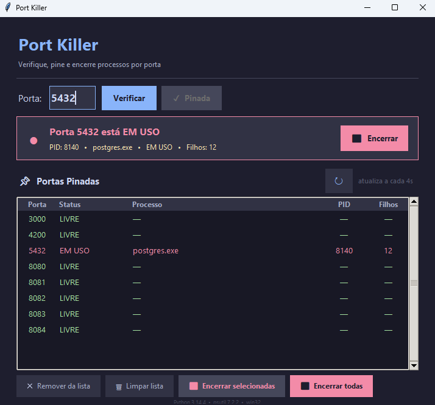

# 🔌 Port Killer

Utilitário desktop para **verificar e encerrar processos** que estão ocupando uma porta de rede — com interface gráfica moderna e suporte a **Windows**, **Linux** e **macOS**.

Desenvolvido com **Python 3** e **tkinter**, usando **psutil** para inspeção de processos e conexões em tempo real.

<p align="center">
  <a href="https://github.com/holandale0/port-killer/releases/download/1.0.0/PortKiller_Setup_1.0.0.exe">
    
  </a>
  &nbsp;
  <a href="https://github.com/holandale0/port-killer/releases/download/1.0.0/PortKiller-1.0.0-x86_64.AppImage">
    
  </a>
  &nbsp;
  <a href="https://github.com/holandale0/port-killer/releases/download/1.0.0/PortKiller-1.0.0.dmg">
    
  </a>
</p>

---

## 📸 Screenshot



---

## ✨ Funcionalidades

- Verifica qual processo está usando uma porta específica (1–65535)
- Exibe **PID**, **nome do processo**, **status** e **quantidade de processos filhos** em tempo real
- **Lista de portas pinadas** — persiste entre sessões (salvo em arquivo JSON local)
- **Auto-refresh** da lista a cada 4 segundos
- Status detalhado por porta: `EM USO`, `LIVRE`, `DORMINDO`, `PARADO`, `ZUMBI`, `AGUARD. E/S`
- Encerra processo individual via botão ou duplo clique na lista
- **Encerrar selecionadas** — selecione múltiplas portas (Ctrl/Shift+clique) e mate de uma vez
- **Encerrar todas** — encerra todos os processos ativos da lista com um clique
- Confirmação obrigatória nas ações em massa; senha sudo nas ações em massa no Linux/macOS
- Interface **dark mode** com tema [Catppuccin Mocha](https://github.com/catppuccin/catppuccin)
- Distribuído como executável standalone — **sem precisar instalar Python**

---

## 🚨 Riscos de encerrar um processo

> [!CAUTION]
> **Encerrar um processo é uma ação irreversível.** Use esta ferramenta com consciência. Em ambientes que não sejam de desenvolvimento local, as consequências podem ser graves e difíceis de reverter.

| Cenário | Seguro? |
|---|---|
| Servidor de desenvolvimento local travado | ✅ Sim |
| Processo desconhecido em porta inesperada | ⚠️ Verifique antes |
| Banco de dados com aplicações conectadas | ❌ Risco de perda de dados |
| Serviços do sistema operacional | ❌ Risco de instabilidade |
| Qualquer processo em produção | ❌ Não recomendado |

**Perda de dados** — Processos de banco de dados, editores e servidores de arquivo mortos abruptamente não têm chance de salvar estado ou fechar transações. Resultado: arquivos corrompidos, registros inconsistentes ou necessidade de recovery manual.

**Queda em cascata** — Serviços que dependem do processo encerrado também falham. Matar um banco de dados derruba todas as aplicações conectadas. Matar um servidor de autenticação pode bloquear o acesso a todo um sistema.

**Serviços críticos do SO** — Matar processos como DNS, firewall, antivírus ou agentes de segurança pode desestabilizar o sistema ou abrir brechas de segurança até a próxima reinicialização.

**Processos filhos órfãos** — O app encerra apenas o processo identificado pelo PID. Processos filhos podem continuar rodando em segundo plano, consumindo recursos ou mantendo a porta ocupada.

**Encerramento forçado (SIGKILL)** — Se o processo não responder ao SIGTERM, o app aplica SIGKILL — uma finalização forçada que o processo não pode capturar, ignorar ou tratar. Nenhum dado em memória é salvo.

**Ambientes de produção** — Nunca use esta ferramenta em servidores de produção sem antes entender exatamente o que o processo faz. Interromper um servidor web ativo encerra imediatamente todas as sessões de usuários conectados.

---

## 🧰 Tecnologias

| Tecnologia | Versão | Uso |
|---|---|---|
| Python | 3.10+ | Linguagem principal |
| tkinter | built-in | Interface gráfica |
| psutil | ≥ 5.9.0 | Inspeção de processos e conexões de rede |
| PyInstaller | ≥ 6.0 | Empacotamento do executável standalone |
| Inno Setup | 6 | Criação do instalador Windows (.exe) |

---

## 💻 Instalação

### Executável pré-compilado (recomendado)

Baixe o instalador do seu sistema na página de [Releases](https://github.com/holandale0/port-killer/releases):

| Plataforma | Arquivo |
|---|---|
| Windows 10 / 11 (64-bit) | `PortKiller_Setup_1.0.0.exe` |
| Linux (x86_64) | `PortKiller-1.0.0-x86_64.AppImage` |
| macOS | `PortKiller-1.0.0.dmg` |

> O instalador já inclui o Python e todas as dependências — nenhuma instalação prévia é necessária.

### Executar pelo código-fonte

```bash
git clone https://github.com/holandale0/port-killer.git
cd port-killer
pip install -r requirements.txt
python port_killer.py
```

---

## 🏗️ Gerar os instaladores

Execute o script de build na plataforma desejada. Ele instala o PyInstaller, empacota o executável com Python embutido e gera o instalador nativo automaticamente.

```bash
python build.py
```

Resultado por plataforma:

| Plataforma | Pré-requisito extra | Saída |
|---|---|---|
| Windows | [Inno Setup 6](https://jrsoftware.org/isdl.php) | `installer/windows/Output/PortKiller_Setup_1.0.0.exe` |
| Linux | [appimagetool](https://github.com/AppImage/AppImageKit/releases) | `dist/PortKiller-1.0.0-x86_64.AppImage` |
| macOS | `hdiutil` *(já incluso no macOS)* | `dist/PortKiller-1.0.0.dmg` |

> Cada plataforma deve ser compilada em sua própria máquina — PyInstaller não suporta cross-compilation.

---

## ✅ Checklist

- [x] Verificação de porta em tempo real
- [x] Exibição de PID, nome, status e processos filhos
- [x] Encerramento de processo individual com confirmação
- [x] Lista de portas pinadas com persistência entre sessões
- [x] Auto-refresh da lista a cada 4 segundos
- [x] Status detalhado: EM USO, LIVRE, DORMINDO, PARADO, ZUMBI etc.
- [x] Encerrar processo por duplo clique na lista
- [x] Encerrar processos selecionados (multi-seleção)
- [x] Encerrar todos os processos da lista
- [x] Dialog de confirmação com senha sudo (Linux/macOS)
- [x] Limpar lista pinada
- [x] Interface dark mode (Catppuccin Mocha)
- [x] Instalador Windows com wizard (Inno Setup)
- [x] AppImage para Linux
- [x] DMG para macOS
- [x] Script de build automatizado (`build.py`)

---

## ⚠️ Permissões

Em alguns sistemas pode ser necessário executar como **Administrador** (Windows) ou com **sudo** (Linux/macOS) para visualizar processos de sistema ou encerrar processos privilegiados.
